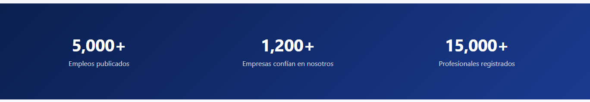

## Por corregir 
- Corregir el header de la pagina principal solo la parte en donde dice mi cuenta 
- Poner a funcionar el buscardor
- Poner a funcionar los exploradores por categorias
- En empleos Destacados poner a funcioanar el ver detalles 
- Cambiar eso ya que no tiene nada que ver con nuestra empresa dejar el diseño solo cambiar lo que esta dentro es decir la información

- En la zona de empleos cambiar muchas cosas no he revisado a fondo y tambien poner a funcionar todo lo que esta dentro
- En mi perfil poner a funcionar todo y cambiar el header ya que lo de registrarse y iniciar sesion debe de ir en la pagina principal 
- Aun falta los demas log in que son lo de TH, manager y banco 
- Falta la opcion de que las personas puedan poner sus pdf con las infonacion de sus hojas de vida
- Hacer funcionar el db.json para que las fotod de las personas se guarden ahí y se puedan colocar automaticamente el la foto de su perfil y poner a funcionar la opcion de editar por si las personas no les gusta su foto del perfil
- lo de las capacitaciones no estoy seguro si lo dejamos lo vamos a colocar a votacion pa ver si lo dejamos o lo quitamos
- quitar la foto que esta de prueba en la parte de perfil

-este es un cambio